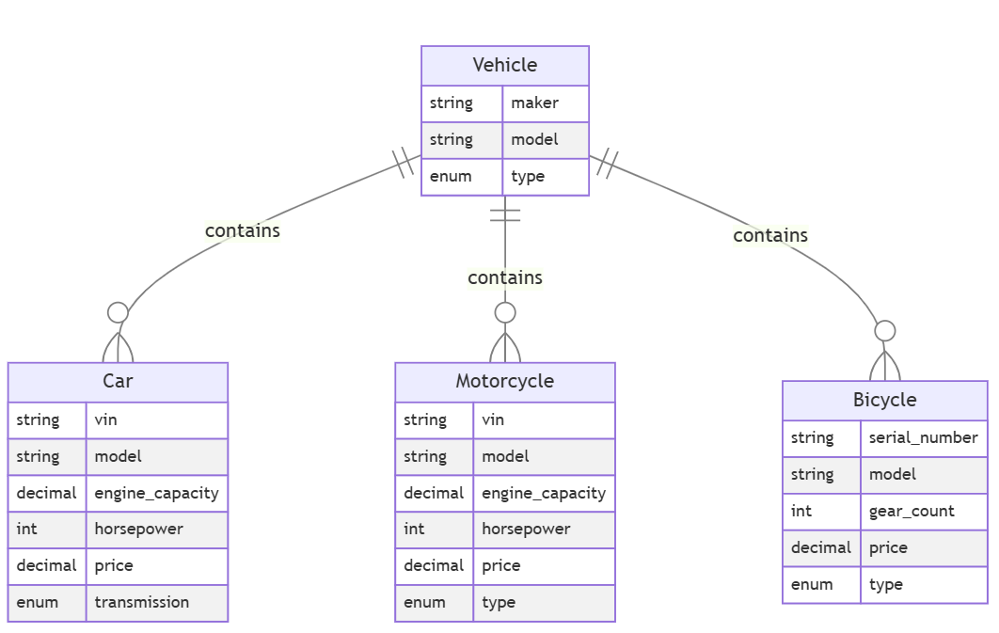
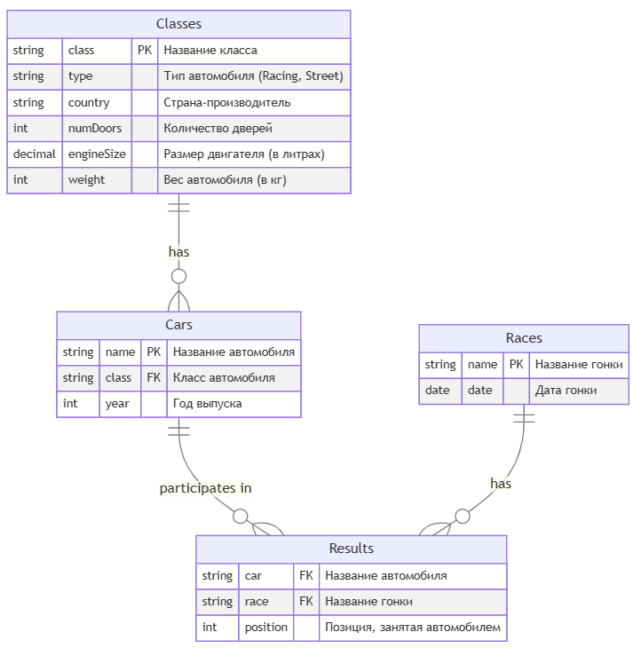
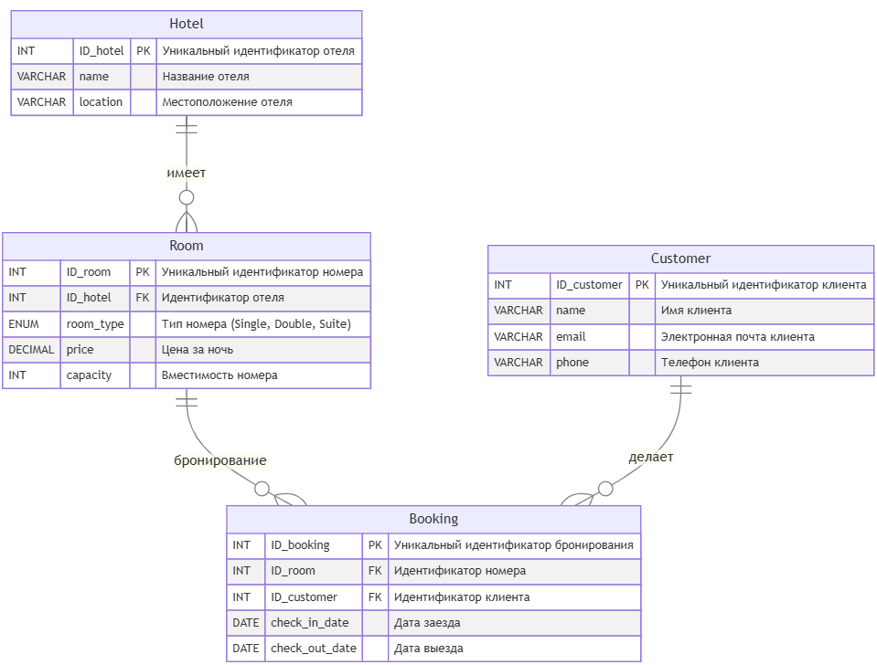
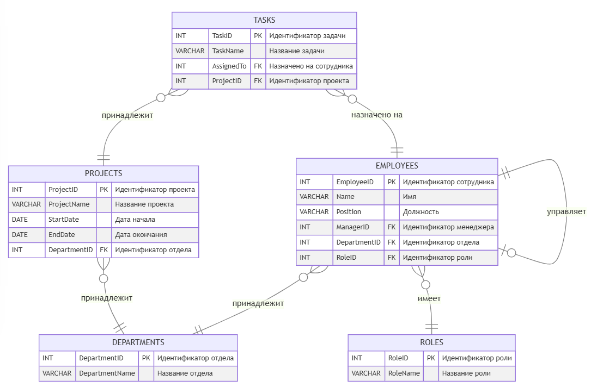

# SQL Homework (PostgreSQL)

## О проекте

Репозиторий содержит решения 13 задач по SQL для четырех учебных баз данных.
В каждой папке есть `create.sql`, который включает:

- создание таблиц
- наполнение тестовыми данными

Базы данных:

- `vehicles` - транспортные средства (2 задачи)
- `racing` - автомобильные гонки (5 задач)
- `hotels` - бронирование отелей (3 задачи)
- `organization` - структура организации (3 задачи)

---

## Цели и задачи проекта

### Цель

Практическое закрепление навыков работы с SQL на примере четырех баз данных, путем решения 13 задач

### Задачи

Попрактиковать:

1. **Базовые операции SQL**
    - `SELECT`, `WHERE`, `JOIN`, `ORDER BY`, `GROUP BY`
    - Фильтрация данных по одному и нескольким условиям
    - Объединение таблиц (INNER JOIN, LEFT JOIN и т.д.)

2. **Агрегирующие функции**
    - `COUNT()`, `AVG()`, `SUM()`, `MIN()`, `MAX()`
    - Использование `HAVING` для фильтрации групп

3. **Объединение результатов**
    - `UNION` для объединения результатов
    - Общие табличные выражения (`WITH` / CTE)
    - Рекурсивные CTE (`WITH RECURSIVE`) для иерархических данных

4. **Функции работы со строками и условной логикой**
    - `STRING_AGG()` для конкатенации значений
    - `CASE WHEN` для условных выражений

---

## Структура репозитория

```text
sql_homework/
├── README.md
├── img/  - схемы баз данных
├── vehicles/
│   ├── create.sql
│   ├── task1.sql
│   └── task2.sql
├── racing/
│   ├── create.sql
│   ├── task1.sql
│   ├── task2.sql
│   ├── task3.sql
│   ├── task4.sql
│   └── task5.sql
├── hotels/
│   ├── create.sql
│   ├── task1.sql
│   ├── task2.sql
│   └── task3.sql
└── organization/
    ├── create.sql
    ├── task1.sql
    ├── task2.sql
    └── task3.sql
```

---

## Описание структур данных и реализованные функции

Связи между таблицами реализованы с использованием внешних ключей с помощью ключевого слова `REFERENCES` (->)

### 1. База данных "vehicles" (Транспортные средства)

**Схема:**



**Таблицы:**

- **Vehicle** - основная таблица для всех типов транспортных средств
    - `model` (VARCHAR, PRIMARY KEY) - модель
    - `maker` (VARCHAR) - производитель
    - `type` (VARCHAR) - тип (Car, Motorcycle, Bicycle)

- **Car** - данные об автомобилях
    - `vin` (VARCHAR, PRIMARY KEY) - VIN номер
    - `model` (VARCHAR, FK -> Vehicle) - связь с моделью
    - `engine_capacity` (DECIMAL) - объем двигателя
    - `horsepower` (INT) - мощность
    - `price` (DECIMAL) - цена
    - `transmission` (VARCHAR) - тип коробки передач

- **Motorcycle** - данные о мотоциклах
    - `vin` (VARCHAR, PRIMARY KEY) - VIN номер
    - `model` (VARCHAR, FK -> Vehicle) - связь с моделью
    - `engine_capacity` (DECIMAL) - объем двигателя
    - `horsepower` (INT) - мощность
    - `price` (DECIMAL) - цена
    - `type` (VARCHAR) - тип (Sport, Cruiser, Touring)

- **Bicycle** - данные о велосипедах
    - `serial_number` (VARCHAR, PRIMARY KEY) - серийный номер
    - `model` (VARCHAR, FK -> Vehicle) - связь с моделью
    - `gear_count` (INT) - количество передач
    - `price` (DECIMAL) - цена
    - `type` (VARCHAR) - тип (Mountain, Road, Hybrid)

**Реализованные функции:**

- Фильтрация мотоциклов по характеристикам (мощность, цена, тип)
- Объединение данных о разных типах транспорта в один результат (UNION ALL)
- Сортировка по техническим характеристикам

---

### 2. База данных "racing" (Автомобильные гонки)

**Схема:**



**Таблицы:**

- **Classes** - классы автомобилей
    - `class` (VARCHAR, PRIMARY KEY) - название класса
    - `type` (VARCHAR) - тип (Racing, Street)
    - `country` (VARCHAR) - страна производства
    - `numDoors` (INT) - количество дверей
    - `engineSize` (DECIMAL) - объем двигателя
    - `weight` (INT) - вес

- **Cars** - автомобили для гонок
    - `name` (VARCHAR, PRIMARY KEY) - название автомобиля
    - `class` (VARCHAR, FK -> Classes) - класс
    - `year` (INT) - год выпуска

- **Races** - гоночные события
    - `name` (VARCHAR, PRIMARY KEY) - название гонки
    - `date` (DATE) - дата

- **Results** - результаты гонок
    - `car` (VARCHAR, FK -> Cars) - автомобиль
    - `race` (VARCHAR, FK -> Races) - гонка
    - `position` (INT) - позиция финиша
    - PRIMARY KEY (car, race)

**Реализованные функции:**

- Вычисление средней позиции автомобиля в гонках (AVG)
- Поиск лучшего автомобиля в каждом классе
- Агрегация результатов с группировкой по классам
- Фильтрация классов и автомобилей по производительности
- Подсчет количества гонок с плохими результатами

---

### 3. База данных "hotels" (Бронирование отелей)

**Схема:**



**Таблицы:**

- **Hotel** - отели
    - `ID_hotel` (SERIAL, PRIMARY KEY) - уникальный идентификатор
    - `name` (VARCHAR) - название отеля
    - `location` (VARCHAR) - местоположение

- **Room** - номера в отелях
    - `ID_room` (SERIAL, PRIMARY KEY) - уникальный идентификатор
    - `ID_hotel` (INT, FK -> Hotel) - отель
    - `room_type` (VARCHAR) - тип номера (Single, Double, Suite)
    - `price` (DECIMAL) - цена за ночь
    - `capacity` (INT) - вместимость

- **Customer** - клиенты
    - `ID_customer` (SERIAL, PRIMARY KEY) - уникальный идентификатор
    - `name` (VARCHAR) - имя
    - `email` (VARCHAR UNIQUE) - электронная почта
    - `phone` (VARCHAR) - телефон

- **Booking** - бронирования
    - `ID_booking` (SERIAL, PRIMARY KEY) - уникальный идентификатор
    - `ID_room` (INT, FK -> Room) - номер
    - `ID_customer` (INT, FK -> Customer) - клиент
    - `check_in_date` (DATE) - дата заезда
    - `check_out_date` (DATE) - дата выезда

**Реализованные функции:**

- Подсчет количества бронирований по клиентам
- Агрегация отелей, в которых бронировал клиент
- Категоризация отелей по средней стоимости номера (CASE WHEN)
- Вычисление средней длительности проживания
- Конкатенация названий отелей (STRING_AGG)
- Анализ предпочтений клиентов по типам отелей
- Поиск клиентов с множественными бронированиями

---

### 4. База данных "organization" (Структура организации)

**Схема:**



**Таблицы:**

- **Departments** - отделы
    - `DepartmentID` (SERIAL, PRIMARY KEY) - уникальный идентификатор
    - `DepartmentName` (VARCHAR) - название отдела

- **Roles** - роли сотрудников
    - `RoleID` (SERIAL, PRIMARY KEY) - уникальный идентификатор
    - `RoleName` (VARCHAR) - название роли

- **Employees** - сотрудники
    - `EmployeeID` (SERIAL, PRIMARY KEY) - уникальный идентификатор
    - `Name` (VARCHAR) - имя
    - `Position` (VARCHAR) - должность
    - `ManagerID` (INT, FK -> Employees) - менеджер (самоссылка)
    - `DepartmentID` (INT, FK -> Departments) - отдел
    - `RoleID` (INT, FK -> Roles) - роль

- **Projects** - проекты
    - `ProjectID` (SERIAL, PRIMARY KEY) - уникальный идентификатор
    - `ProjectName` (VARCHAR) - название
    - `StartDate` (DATE) - дата начала
    - `EndDate` (DATE) - дата окончания
    - `DepartmentID` (INT, FK -> Departments) - отдел

- **Tasks** - задачи
    - `TaskID` (SERIAL, PRIMARY KEY) - уникальный идентификатор
    - `TaskName` (VARCHAR) - название задачи
    - `AssignedTo` (INT, FK -> Employees) - назначена сотруднику
    - `ProjectID` (INT, FK -> Projects) - проект

**Реализованные функции:**

- **Рекурсивные запросы (WITH RECURSIVE)**
    - Построение иерархии сотрудников от генерального директора
    - Получение всех подчиненных сотрудника (включая подчиненных подчиненных)
    - Подсчет общего количества подчиненных

- **Агрегация и конкатенация**
    - STRING_AGG для объединения проектов и задач в одно поле
    - Подсчет общего количества задач на сотрудника
    - Подсчет количества прямых подчиненных

- **Фильтрация и анализ**
    - Поиск всех сотрудников под управлением конкретного руководителя
    - Выборка менеджеров с подчиненными
    - Связь сотрудников с проектами и задачами

---

## Как запустить и проверить

1. Создать базы данных в PostgreSQL:

### vehicles:

```sql
create database vehicles
with template=template0
  encoding='UTF8'
  lc_collate='ru_RU.UTF-8'
  lc_ctype='ru_RU.UTF-8'
owner <владелец>;
```

### racing:

```sql
create database racing
with template=template0
  encoding='UTF8'
  lc_collate='ru_RU.UTF-8'
  lc_ctype='ru_RU.UTF-8'
owner <владелец>;
```

### hotels:

```sql
create database hotels
with template=template0
  encoding='UTF8'
  lc_collate='ru_RU.UTF-8'
  lc_ctype='ru_RU.UTF-8'
owner <владелец>;
```

### organization:

```sql
create database organization
with template=template0
  encoding='UTF8'
  lc_collate='ru_RU.UTF-8'
  lc_ctype='ru_RU.UTF-8'
owner <владелец>;
```

2. Создать таблицы и заполнить их данными (выполнить `create.sql`)
3. Выполнить соответствующие `task*.sql` и сверить результат с ожидаемым выводом из заданий
